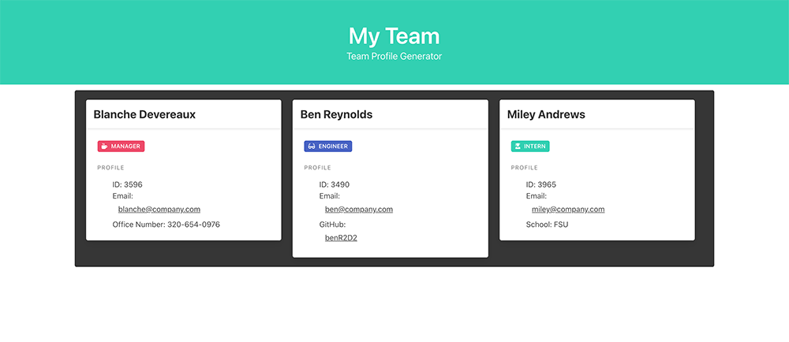

# Team Profile Generator

 

## Description
An app that generates an HTML file displaying the Employees on a team, based on user input into the terminal. Created using test driven development, JavaScript, Node.js, Jest, and Inquirer.

## Video Walk-through

## Table of Contents
* [Installation](#installation)
* [Usage](#usage)
* [Contributing](#contributing)
* [Tests](#tests)
* [License](#license)
## Installation

*Steps required to install this project and get the application running:*

Node.js and Inquirer are needed to run this application.
 ## Usage
*Instructions for use:*
This project is for anyone who wants to build a profile page for their work team. Initially, it runs in the Node.js environment and the user answers prompts about their team and this program will create a profile visualization of the whole team in an HTML file.

## Tests
*The following tests are available for this project:*
Testing is done via Jest 

## License
Open

### Questions?

For any questions, please contact me with the information below:

GitHub: [@AF-cmdZ](https://api.github.com/users/AF-cmdZ)
